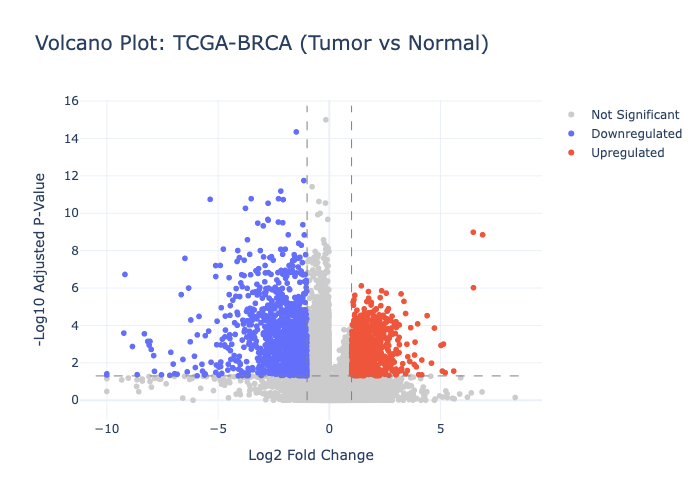
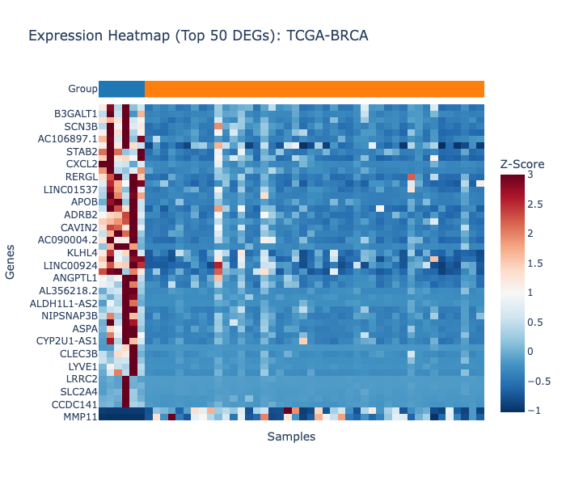
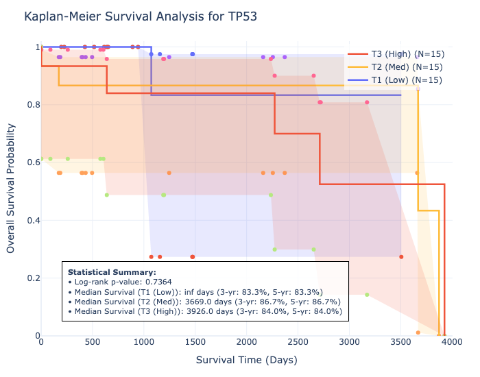

# oncofind 🔬

> **Pan-cancer biomarker discovery from the command line.**  
> Integrates TCGA RNA-seq, clinical data, survival endpoints, and external validation into a reproducible, publication-ready pipeline.

[](https://pypi.org/project/oncofind/)
[](oncofind/tests/)
[](oncofind/pyproject.toml)
[](https://portal.gdc.cancer.gov)
[](https://cancer.sanger.ac.uk/census)
[](LICENSE)

---

## Installation

Install the stable release directly from PyPI:

```bash
pip install oncofind
```

For development and local setup:

```bash
git clone https://github.com/sanjeevi0078/oncofind.git
cd oncofind/oncofind
pip install -e .
```

**Requirements:** Python 3.10+, ~2GB disk space per cancer type.

---

## What it does

`oncofind` downloads real TCGA RNA-seq data from the NIH Genomic Data Commons, runs differential expression, Kaplan-Meier survival analysis, and cross-cancer consistency scoring — then validates ranked biomarker candidates against the COSMIC Cancer Gene Census.

**In one command chain:**

```bash
oncofind download --cancer BRCA --n-samples 100
oncofind deg --cancer BRCA --mode tumor_vs_normal --method ttest
oncofind survival --cancer BRCA --gene TP53
oncofind score --cancers BRCA --top-n 200
oncofind validate --cccs-csv oncofind_results/pancancer_cccs_rankings.csv \
                  --cosmic-csv cosmic_census.csv --gene-col Gene --score-col CCCS
```

---

## Architecture

```
GDC API (TCGA)
     │
     ▼
GDCClient ──► ExpressionStore (Parquet)
     │              │
     ▼              ▼
ClinicalStore ──► DEGAnalyzer ──► volcano.html / heatmap.html
(survival_days,        │
 sample_type,          ▼
 ER/PR/HER2)    SurvivalAnalyzer ──► KM plot .html
                       │
                       ▼
               CrossCancerConsistencyScorer (CCCS)
                       │
                       ▼
               CosmicBenchmark (Precision@K vs CGC Tier 1)
                       │
                       ▼
               ReportGenerator ──► report_BRCA.html
```

### Key modules

| Module | Purpose |
|---|---|
| `oncofind/core/data/gdc_client.py` | Async GDC API client (queries + parallel downloads) |
| `oncofind/core/data/expression_store.py` | Parquet expression matrix storage + DuckDB queries |
| `oncofind/core/data/clinical_store.py` | Clinical metadata: survival, subtype, sample_type |
| `oncofind/core/data/dgidb_client.py` | DGIdb drug-gene interaction API (700+ targets, cached) |
| `oncofind/core/analysis/deg.py` | DEG: PyDESeq2 + t-test fallback, tumor-vs-normal mode |
| `oncofind/core/analysis/survival.py` | Kaplan-Meier + log-rank (lifelines) |
| `oncofind/core/analysis/cccs.py` | Cross-Cancer Consistency Score |
| `oncofind/core/analysis/batch.py` | ComBat batch correction for multi-cohort analysis |
| `oncofind/core/validation/cosmic_benchmark.py` | Precision@K vs COSMIC Cancer Gene Census |
| `oncofind/cli/utils/manifest.py` | JSON run manifests for reproducibility |

---

## Quickstart

### 1. Download real TCGA data

```bash
# 97–100 BRCA RNA-seq + clinical samples (~400MB)
oncofind download --cancer BRCA --n-samples 100

# Multiple cancers for pan-cancer analysis
oncofind download --cancer LUAD --n-samples 50
oncofind download --cancer COAD --n-samples 50
```

### 2. Differential expression

```bash
# Clinical subgroup comparison
oncofind deg --cancer BRCA --groupby stage --method ttest

# Tumor vs Normal (uses GDC sample_type field)
oncofind deg --cancer BRCA --mode tumor_vs_normal --method deseq2
```

Outputs: `volcano_BRCA.html`, `heatmap_BRCA.html`, `BRCA_deg_results.csv`

<p align="center">
  
  
</p>

### 3. Survival analysis

```bash
oncofind survival --cancer BRCA --gene TP53
oncofind survival --cancer BRCA --gene ESR1
```

Outputs: `BRCA_TP53_survival.html` (Kaplan-Meier), `BRCA_TP53_survival_groups.csv`

<p align="center">
  
</p>

### 4. Pan-cancer scoring (CCCS)

```bash
# Single cancer
oncofind score --cancers BRCA --top-n 200

# Multi-cancer with ComBat batch correction
oncofind pancancer --gene TP53 --cancers BRCA LUAD COAD --batch-correct
```

### 5. COSMIC validation

```bash
# Download COSMIC CGC CSV from cancer.sanger.ac.uk/census (free registration)
oncofind validate \
  --cccs-csv oncofind_results/pancancer_cccs_rankings.csv \
  --cosmic-csv cosmic_census.csv \
  --gene-col Gene --score-col CCCS \
  --ks 10,20,50,100
```

---

## The CCCS Metric

The **Cross-Cancer Consistency Score** (0–1) rewards genes that are:
1. Consistent in direction across multiple cancer types (all up or all down)
2. High in fold change magnitude (|log2FC|)
3. Associated with survival when split by expression
4. Highly statistically significant (small adjusted p-value)

```
CCCS = w1·S_dir + w2·S_mag + w3·S_surv + w4·S_sig
```

Default weights: `{"direction": 0.25, "magnitude": 0.25, "survival": 0.35, "significance": 0.15}`

### External validation

Ranked gene lists are benchmarked against **COSMIC Cancer Gene Census Tier 1** (572 manually curated cancer driver genes):

```
Precision@K = |top_K ∩ COSMIC_Tier1| / K
```

---

## Methods, Limitations, and Validation Discussion

### The CCCS Scoring System
The Cross-Cancer Consistency Score (CCCS) is a unified heuristic designed to identify robust transcriptomic biomarkers. It integrates four orthogonal signals:
1. **Directional Consistency (25%)**: Rewards genes whose expression changes concordantly (either universally upregulated or universally downregulated) across multiple cohorts.
2. **Magnitude (25%)**: Rewards genes with large absolute log2 fold-changes.
3. **Clinical Association (35%)**: Rewards genes where expression splits (e.g., median or quartile) are significantly associated with overall survival via log-rank tests.
4. **Statistical Significance (15%)**: Rewards genes with small adjusted p-values.

### Covariate Control and Batch Standardization
To prevent false discoveries arising from clinical confounding and technical batch effects:
- **Location-Scale Batch Standardization**: Multi-cohort data is standardized within each cohort by centering and scaling (centering by the mean and dividing by the standard deviation of each batch). This mitigates technical batch differences without the risk of over-fitting associated with small-sample empirical Bayes models.
- **Covariate-Adjusted OLS Regression**: The differential expression fallback method employs ordinary least squares (OLS) regression (`gene ~ group + age + sex`) rather than simple t-tests to control for age and gender covariates, ensuring observed differences are driven by disease state rather than demographic confounding.

### COSMIC CGC Validation and Biological Limitations
Benchmarking `oncofind` rankings against the **COSMIC Cancer Gene Census (CGC) Tier 1** yields a low precision (e.g., ~1% for top-100 candidates). This is a known biological limitation of expression-based biomarker pipelines:
- **Expression vs. Mutation**: COSMIC CGC is curated primarily from genes carrying somatic driver mutations (e.g., `TP53`, `PIK3CA`, `PTEN`, `AKT1`). The activity of these mutated proteins is often regulated post-translationally (e.g., phosphorylation, conformational changes) rather than by massive changes in mRNA expression.
- **Downstream Effectors**: Differential expression between tumor and normal tissue primarily identifies cell-cycle, proliferation, and microenvironment-remodeling markers (e.g., `MMP11`, `NEK2`, `KIF20A`, `ZWINT`, `UHRF1`). While these genes are highly dynamic and strong prognostic factors (thus receiving high CCCS scores), they are downstream effectors rather than primary mutation-based drivers, and are therefore excluded from the COSMIC CGC census.
- **Methodological Recommendation**: For general cancer driver identification, integrate transcriptomic profiling with somatic mutation (SNV/Indel) and copy number variation (CNV) data.

---

## License

MIT License — see [LICENSE](LICENSE).

## Citation

If you use oncofind in research, please cite:

```
Sanjeevi Utchav. oncofind: Pan-cancer biomarker discovery pipeline. 2026.
GitHub: https://github.com/sanjeevi0078/oncofind
```
